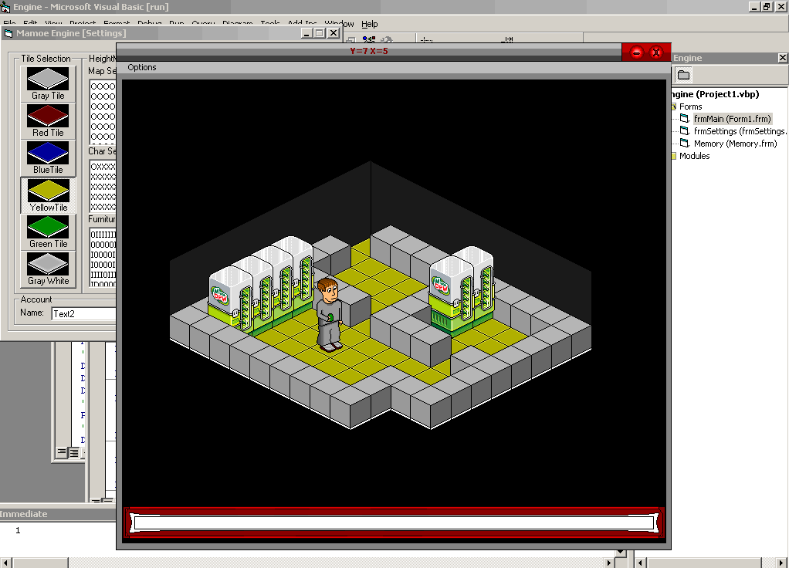



## Game Engine Fully Commented

### Description

Well, the code is fully commented and it's a very nice program. Got an A on my final because of this program. The program is easy to use it starts out with default values if you dont know what your doing yet just run the default then use your up down left and right keys to move and when your infront of the dew machine press enter and you got yourself a drink. Please Vote.
 
### More Info
 

             |
---                |---
**Submitted On**   |2004-11-27 15:32:04
**By**             |[Evgeni\(Aries\)](https://github.com/Planet-Source-Code/PSCIndex/blob/master/ByAuthor/evgeni-aries.md)
**Level**          |Advanced
**User Rating**    |4.8 (62 globes from 13 users)
**Compatibility**  |VB 6\.0
**Category**       |[Games](https://github.com/Planet-Source-Code/PSCIndex/blob/master/ByCategory/games__1-38.md)
**World**          |[Visual Basic](https://github.com/Planet-Source-Code/PSCIndex/blob/master/ByWorld/visual-basic.md)
**Archive File**   |[Game\_Engin18223711272004\.zip](https://github.com/Planet-Source-Code/evgeni-aries-game-engine-fully-commented__1-56626/archive/master.zip)

